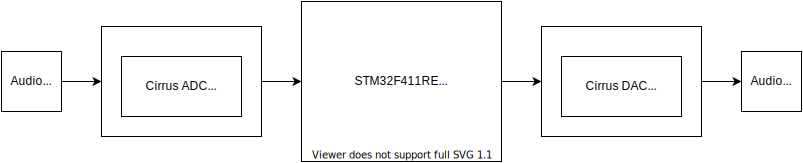
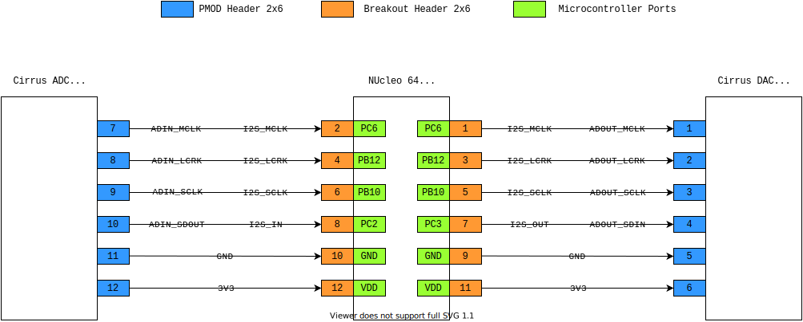

## Breakout board for STM NucleoF411 to Digilent Pmod I2S2

This breakout board allows easy connection between Digilent Pmod I2S2 and STM NucleoF411

#### System Overview
 

The breakout board matches the specific pin mapping of the 2x6 header from the Digilent Pmod I2S2.

Note, the MCLK, LCRK, SCLK clock signals are electrically connected across both Cirrus devices and the MCU

#### Connector and Port Mappings
 

